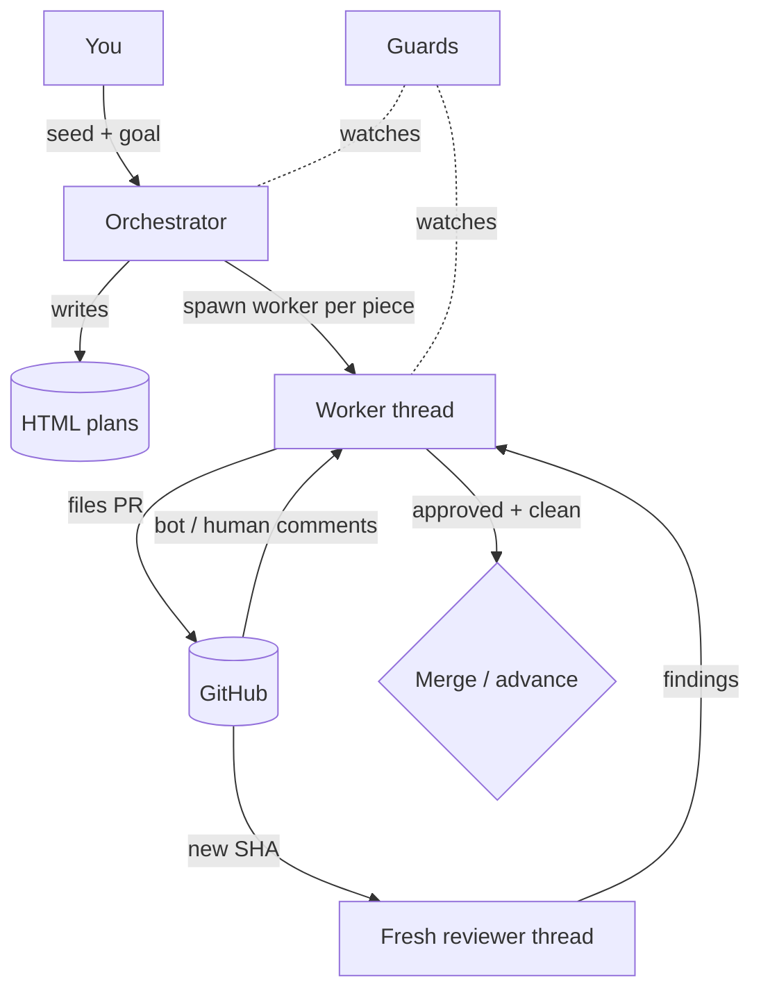

# Concepts
{: .no_toc }

The mental model: loops, threads, state, and guards.
{: .fs-6 .fw-300 }

<details open markdown="block">
  <summary>On this page</summary>
  {: .text-delta }
- TOC
{:toc}
</details>

---

## Loops, not prompts

The unit of work is a **loop definition**, not a single agent turn. A loop wakes
on a heartbeat, reads some state, decides what to do, spawns agents to do it, and
either continues or stops. The four loops below are all built on the same small
set of primitives.



## The four canonical loops

### 5A — Single-PR monitor

The entry point and the simplest useful loop. Watches **one** PR in its own
worktree. Each heartbeat it: checks guards → reads PR state → on a *new commit*
spawns a fresh reviewer → folds in bot/human comments → addresses findings (each
via a worker that commits + pushes) → resolves the threads it fixed and posts an
acknowledgment → stops when the PR is approved and clean.

- **Verification:** a finding is only marked resolved if the worktree **HEAD
  actually advanced** — a worker that claims success without committing leaves
  the finding open to re-touch (and eventually trips divergence).
- **Source:** [`src/loops/single-pr-monitor.ts`](architecture#loops)

### 5B — Dynamic stacked-PR meta-workflow

The payoff. For work too big for one PR. You don't hardcode the steps — an agent
generates them:

1. **`compose`** — an agent inspects the repo and decomposes the goal into
   ordered `pieces`, each with a scope and a worktree. Validated and written as
   `plan.json` + HTML. **Stops for your approval.**
2. **`run`** — the orchestrator walks the plan into *waves* (parallel where safe,
   stacked where dependent). Per piece: create worktree → implement → file PR →
   spawn a single-PR monitor **sub-loop** → on approval, advance.

Loops create loops (P3): the orchestrator spawns a monitor per piece, and each
monitor spawns reviewers per commit.

Two advance modes:

| Mode | Flag | Behavior |
|------|------|----------|
| **merge-pull-next** (default) | — | Each piece merges to base before dependents start; dependents branch off the freshly merged base. |
| **stack-on-parent** | `--stacked` | Each dependent branches off its parent's PR branch; **nothing merges mid-run**; you merge the approved stack bottom-up. Requires a linear chain. |

- **Source:** [`src/loops/orchestrator.ts`](architecture#loops),
  [`src/loops/compose.ts`](architecture#loops)

### 5C — Linear `goal_loop` grinder

For one long track with nothing to parallelize (rewrites, migrations,
exploratory builds). One thread grinds a single goal in an isolated worktree.
Each turn the agent self-reports `{done, summary, next}`; the loop feeds `next`
back as "where you left off" and **halts on a no-progress streak** (the linear
analog of divergence detection). Output is experimental by default.

- **Source:** [`src/loops/goal-loop.ts`](architecture#loops)

### 5D — Watch / context loops

Loops that *bring information to you*. A heartbeat + an injected **observer** + a
pluggable **notifier**; it diffs each observation against a last-seen digest and
notifies only on deltas (new / changed / gone). Ships an open-PR watcher and
stdout/log notifiers.

- **Source:** [`src/loops/watch.ts`](architecture#loops),
  [`src/adapters/notifier.ts`](architecture#adapters)

## Threads & state (§7)

Every loop persists minimal explicit state so a heartbeat (or a process restart,
or a `--once` cron tick) can make decisions without re-deriving everything. State
lives in `.harness/state.json`, written atomically and serialized so parallel
pieces never corrupt it.

```
Thread {
  id
  role: orchestrator | worker | reviewer | watcher
  worktree: path | null
  pieceId: ref | null
  pr: { number, headSha, checks, approvals, mergeable } | null
  status: planning | implementing | awaiting_review | fixing
        | approved | merged | done | abandoned | halted
  lastReviewedSha: sha | null      // a fresh reviewer spawns only on a new head
  killRequested: bool
  budget: { tokensUsed, iterations, startedAt }
  loopState?: { lastNext, lastSummary, noProgress, touchCounts, resolvedFindingIds }
  notes: string[]
}
```

The single most important transition is **`headSha` change → spawn a fresh
reviewer**. That keeps review in lockstep with the work without a human in the
loop. `loopState` is what makes loops restart-safe: divergence counters, the
grinder's continuation note, and compacted resolved-finding ids all survive a
restart.

## Guards (§9)

The cautionary case the guards exist to prevent: a 10-minute review pass
triggering an *8-hour, 3M-token* run to address three small comments. Every loop
runs its decisions through a `Guard` before doing expensive work.

| Guard | Default | Effect |
|-------|---------|--------|
| Per-loop **token budget** | 1.5M | Halt + report on breach |
| **Per-heartbeat work cap** | 4 fixes | One wake can't spiral |
| **Wall-clock** bound | 4 h | Absolute time limit |
| **Divergence detection** | 4× | Re-editing one area without converging → halt + escalate |
| **Kill-switch** | — | `harness kill <id>`, honored next heartbeat |
| **Blast-radius limit** | — | Agents only act inside their worktree |

- **Source:** [`src/guards.ts`](architecture#core)

## Runtime primitives (§3)

The loops are built on a few pluggable primitives, each an interface with a
default implementation you can swap:

| Primitive | Interface / module | Default implementation |
|-----------|--------------------|------------------------|
| `spawn_thread(seed)` | `ThreadRunner` | `ClaudeCliRunner` → `claude -p --output-format json` |
| `heartbeat(interval, on_wake)` | `heartbeat()` | non-overlapping interval timer |
| `worktree(create/teardown)` | `WorktreeManager` | `git worktree` |
| `run_external(cmd)` | `exec()` | `child_process.spawn` |
| PR host | `GitHubAdapter` | `gh` CLI (REST + GraphQL) |
| notification sink | `Notifier` | stdout / log |

Because they're interfaces, an Agent-SDK runner, a non-GitHub host, or a Slack
notifier can drop in without touching the loops. See
[Architecture](architecture) for how to extend them, and
[Spec mapping & gaps](spec-gaps) for the primitives that are **not** yet built
(notably `computer_use()` for behavioral verification).
