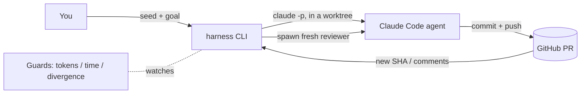

# Getting started
{: .no_toc }

How to bring next-harness into your Claude Code setup and drive your first loop.
{: .fs-6 .fw-300 }

<details open markdown="block">
  <summary>On this page</summary>
  {: .text-delta }
- TOC
{:toc}
</details>

---

## How it fits with Claude Code

next-harness is **not** a Claude Code plugin or skill. It's a small CLI that
*orchestrates* Claude Code: every unit of work is a headless `claude -p` agent
that the harness spawns inside an isolated git worktree, supervises on a
heartbeat, and holds to a budget.



So "bringing this into Claude Code" means two things, and you can do both:

- **Run the harness yourself** from a terminal (or a cron job) — it launches
  Claude Code agents for you.
- **Run it from inside a Claude Code session** — ask Claude Code to run
  `harness …` commands; the harness then spawns *child* Claude Code agents to do
  the work. Loops creating loops.

## Prerequisites

| Requirement | Why | Check |
|-------------|-----|-------|
| **Node ≥ 24** | Runs the TypeScript sources natively — no build step | `node --version` |
| **`claude` CLI** | The agent runtime the harness spawns | `claude --version` |
| **`gh` CLI**, authenticated | Reads/writes PRs, comments, review threads | `gh auth status` |
| A **git repo with a GitHub remote** | The harness operates on PRs | `gh repo view` |

{: .note }
> **Economics (spec P7).** Loops burn many tokens — they are designed for
> flat-rate Claude subscription plans, not metered API pricing. The harness does
> not and cannot check your plan; running heavy loops on per-token billing will
> be expensive. This is a policy you own, not a guard the code enforces.

## Install

The harness has no runtime dependencies (the only `npm` packages are
`typescript` + `@types/node`, used for typechecking). You can run it straight
from source.

```bash
git clone https://github.com/LSDIPPOLLC/next-harness.git
cd next-harness
npm install        # optional: only needed for `npm run typecheck`

# Run a command:
node src/cli.ts help
```

To get a `harness` command on your `PATH`, link the bin:

```bash
npm link           # exposes `harness` globally (uses the bin in package.json)
harness help
```

The rest of these docs write `harness <cmd>`; `node /path/to/next-harness/src/cli.ts <cmd>`
is equivalent.

{: .note }
> **Where it runs matters.** The harness operates on the repo in your **current
> working directory** (`gh` infers the owner/repo from it). `cd` into the target
> repo before running `harness …`. State and worktrees live under that repo's
> `.harness/` — add `.harness/` to its `.gitignore`.

## Authenticate the tools

```bash
gh auth status            # must be logged in; needs repo + (for deletes) admin scopes
claude --version          # must be authenticated to your Claude plan
```

## Your first loop (read-only, ~1 agent call)

Start with the cheapest, safest command: a one-shot self-review of an existing
PR. It attaches a worktree to the PR's branch, spawns a reviewer agent, and
prints findings — it changes nothing.

```bash
cd /path/to/your/repo
harness review 123 --base main
```

You'll get a JSON array of actionable findings. If that works, your
`gh` + `claude` + worktree plumbing is good.

## One supervised tick (writes commits)

Now run a single heartbeat of the single-PR monitor. It will spawn a reviewer
on the PR's current head, then for each finding spawn a worker that **commits
and pushes a fix** — and only marks a finding resolved if the branch head
actually advanced. `--once` runs exactly one tick (ideal for trying it out or a
cron cadence). Omit `--auto-merge` so it stops for you to merge.

```bash
harness watch 123 --once
```

Inspect what it did:

```bash
harness state          # persisted thread state, tokens used, findings
gh pr view 123         # the new commits + the harness's acknowledgment comment
```

Let it run continuously (heartbeat every 7 min) by dropping `--once`:

```bash
harness watch 123      # Ctrl-C to stop; or, from another shell:
harness kill pr-123    # requests a clean stop at the next heartbeat
```

## Your first *generated* workflow

This is the payoff loop (§5B). An agent inspects your repo, decomposes a goal
into ordered pieces, and writes a plan **plus skimmable HTML** — then stops for
your approval. Nothing runs until you say so.

```bash
harness compose "add a /healthz endpoint with a unit test"
# → writes .harness/plan.json and .harness/plans/index.html, then stops
```

Open `.harness/plans/index.html`, review the pieces, then execute:

```bash
harness run .harness/plan.json            # merge-per-wave (default)
harness run .harness/plan.json --stacked  # true stacked PRs (nothing merges mid-run)
```

## Permission posture (important)

The loops must run `git commit` / `git push` with no human to approve each Bash
call, so spawned agents default to **`bypassPermissions`**. This is safe *because*
every agent is confined to an isolated worktree — the blast-radius limit (spec
§9 / P4). Override per command with `--permission-mode`:

```bash
harness watch 123 --permission-mode acceptEdits   # edits auto-approved, Bash gated
```

{: .warning }
> `acceptEdits` will make workers **edit files but silently fail to commit**
> (Bash stays gated with no one to approve it), so findings never actually land.
> Keep the default `bypassPermissions` for the unattended loops, and keep the
> work in worktrees. Each worktree also gets a local git identity
> (`HARNESS_GIT_NAME` / `HARNESS_GIT_EMAIL`) so unattended commits never fail for
> lack of an author.

## Safety rails you should know on day one

- **Budgets are on by default** — 1.5M tokens, 4 fixes per heartbeat, 4h
  wall-clock, divergence halt after re-editing one area 4×. Tune in
  [`src/config.ts`](architecture#configuration).
- **Kill-switch** — `harness kill <threadId>`; honored at the next heartbeat.
- **Approve before you run** — `compose` and `plan` stop for you; `run` only
  executes a plan you pass it.

Next: the [Concepts](concepts) page for how the loops actually work, or jump to
[Recipes](recipes) for end-to-end walkthroughs.
