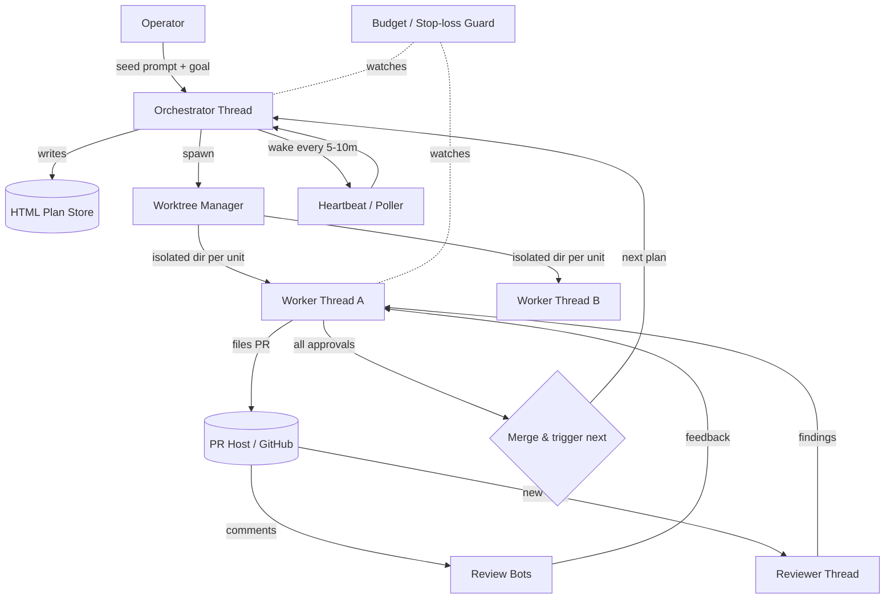
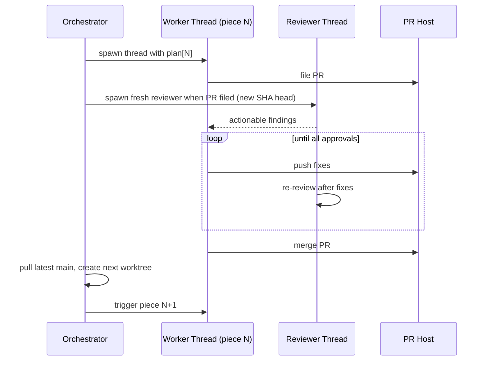

> This is the verbatim *Dynamic Loop Orchestration — Claude Code Harness
> Spec* that next-harness was built from, reproduced so the [gap
> analysis](spec-gaps) can be checked against it.

# Dynamic Loop Orchestration — Claude Code Harness Spec

> An implementation spec for a harness that lets an operator **design loops that prompt agents** instead of prompting agents step by step. Synthesized from a practitioner transcript on dynamic loop orchestration. Provenance notes are at the end.

---

## 0. Thesis

The operator's job shifts from *writing every prompt* to *seeding work and designing the loop that carries it*. The defining claim: **the majority of agent runs should execute prompts the operator did not write.** The operator still authors the seed prompts and reviews the plans; the harness generates and runs the loops, spawns the sub-work, reviews itself, and brings results back.

Two ideas do most of the work:

1. **The shape of the loop is generated from the shape of the problem** — not pre-declared. You ask the agent to build the workflow for *this* task, and it does. Loops can create loops.
2. **The human looks late.** Machine review happens *before* a human reads the code. Reading agent output before another agent has reviewed it is treated as wasted operator time.

Everything below is scaffolding for those two ideas.

---

## 1. Core Principles

| # | Principle | Implication for the harness |
|---|-----------|------------------------------|
| P1 | Loops over per-step prompting | The unit of work is a loop definition, not a single turn. |
| P2 | Dynamic shape > hardcoded personas | No pre-baked "security reviewer / exploration agent" markdown roles. The agent constructs the context and sub-agents it needs at runtime. |
| P3 | Loops may spawn loops | A thread can spin up another thread; an orchestrator can generate a sub-workflow dynamically. Recursion is the feature, not a bug. |
| P4 | Isolation via worktrees | Each unit of work lives in its own directory/worktree so it never blocks other work and can be safely abandoned. |
| P5 | Review before human ("look late") | Code review bots and reviewer threads run first; the human only sees work that already survived a review pass. |
| P6 | Prompt yourself out of the loop | Every manual step you take *after* prompting (run, verify, commit, push, file PR, address comments) is a candidate for delegation. |
| P7 | Subscription economics | Loops burn many tokens and are only viable on flat-rate plans, not at API/metered prices. |
| P8 | Bounded autonomy | Full unattended autonomy is explicitly *not* the target. Loops get budgets, caps, and kill-switches. |

**Anti-principle (do not build):** predefined static personas/roles assigned ahead of time. This defeats the dynamic nature of agents — it's the equivalent of a project template where every file already exists and you can only edit within it.

---

## 2. System Architecture



### Components

- **Orchestrator thread** — owns the goal, writes plans, decides how to break up work, spawns workers/reviewers, and decides when to merge and advance. It does *not* hardcode the breakdown; it derives it.
- **Worker thread** — owns a single unit of work (typically one PR), in its own worktree. Implements the plan, files the PR, and stays alive to address incoming comments.
- **Reviewer thread** — spun up fresh per PR (or per new SHA head). Reads the diff, produces actionable findings, then re-reviews after fixes land.
- **Worktree manager** — creates/tears down isolated checkouts so units don't block each other and can be abandoned cleanly.
- **Heartbeat / poller** — wakes the orchestrator on a schedule (5–10 min) to advance state: detect filed PRs, spawn reviews, pull comments, decide merges.
- **HTML plan store** — human-readable plans the operator can skim (including on mobile) before approving. One plan per unit of work.
- **Workflow generator** — produces the loop definition for *this* task, on demand.
- **Budget / stop-loss guard** — caps tokens, iterations, and wall-clock; detects divergence; kills runaway loops. (See §9.)
- **External**: PR host (GitHub) and third-party review bots (e.g., CodeRabbit, Macroscope, etc.). Their comments are an input signal, not something the operator copy-pastes by hand.

---

## 3. Runtime Primitives Required

The harness assumes the underlying agent runtime exposes (or the harness simulates) these. The source describes the named ones in current coding agents; the spec depends on the *capability*, not the exact name.

| Primitive | Behavior | Used by |
|-----------|----------|---------|
| `spawn_thread(seed)` | A running thread starts a new independent thread with a seed prompt/plan. The foundational primitive — without thread-from-thread there is no dynamic orchestration. | Orchestrator → Worker, Worker → Reviewer |
| `heartbeat(interval, on_wake)` | Schedule a thread to wake on an interval and run a state-advancement routine. | Orchestrator polling loop |
| `goal_loop(goal)` | A *linear* persistent loop: at the end of each turn the thread self-checks "did I finish the goal? if no, continue." Runs until the goal is met. Distinct from a dynamic workflow. | Long single-track tasks (see §5C) |
| `computer_use()` | Drive a browser / dev server to verify behavior, not just compile. | Worker verification step |
| `worktree(create / teardown)` | Isolated checkout per unit of work. | Worktree manager |
| `run_external(cmd)` | Invoke another agent/tool (e.g., a second coding agent) to produce a review, then ingest its output. | Self-review chaining |

> Two loop modes matter and must not be conflated:
> - **Dynamic workflow** — orchestrator generates branching, multi-thread work from a pre-planned goal (§5B).
> - **`goal_loop`** — one thread grinds linearly on a single goal until done (§5C).

---

## 4. The Delegation Ladder (operationalizing P6)

Audit what you do *after* the agent finishes a task and push each rung onto the agent. This ladder is the migration path and the checklist for what a "complete" worker loop covers.

1. **Run** the dev server → agent does it.
2. **Verify** the change actually works (via computer use) → agent does it.
3. **Commit** once verified → agent does it.
4. **Push and file the PR** → agent does it.
5. **Collect** review-bot comments → agent watches the PR; no human copy-paste.
6. **Address** the feedback (optionally by spawning its own reviewer threads) → agent does it.
7. **Merge** and **trigger the next unit** → orchestrator does it.

The operator's residual job: write the seed prompt, read/approve the plan, and step in only for the hard decisions the loop surfaces.

---

## 5. Canonical Loops

### 5A. Single-PR Monitor Loop (the entry point)

The simplest useful loop. Recommended first build.

```
Inputs: one PR scoped to one change, in its own worktree
Loop (per heartbeat):
  1. Read PR state.
  2. If new comments from review bots OR humans:
       - For each actionable comment: implement the fix.
       - Push.
  3. If all checks/approvals satisfied: stop (await operator merge or auto-merge per policy).
  4. Else: sleep until next heartbeat.
Exit: all approvals, OR budget/stop-loss tripped, OR operator halt.
```

Notes: isolated worktree is what makes this safe to leave running for hours — it can't block other work. The source reports leaving such a loop running 6+ hours, accumulating many small improvements unattended.

### 5B. Dynamic Stacked-PR Meta-Workflow (the payoff)

For work too large for one PR. The operator does **not** hardcode the steps; the orchestrator generates this workflow from the goal. The loop **creates sub-loops** (a fresh review loop per PR).

**Setup the orchestrator performs first:**
1. Take the goal + plan. Ask itself: which pieces ship separately, which can be parallelized, which must be stacked.
2. Write one **HTML plan per piece**; operator skims and approves.
3. Order the pieces (mostly stacked, parallelize where safe).

**The generated loop, per piece:**



**Heartbeat routine for 5B** (what runs every 5–10 min):
- Read implementation-thread status.
- Detect filed PRs.
- When a PR has a **new SHA head**, spawn a **fresh** reviewer thread for it.
- Route actionable findings back to the worker.
- Re-review after fixes are pushed.
- On full approval: merge, **pull latest main**, create the next worktree, trigger the next piece.

This is the core capability: *the operator asked whether such a loop could be built, and the agent produced a workflow that dynamically spawns its own review sub-loops sized to each piece* — not a static "one reviewer per change" rule.

### 5C. Linear `goal_loop` (the grinder)

For a single long-running track with no branching: rewrites, large migrations, exploratory builds. One thread, `goal_loop`, self-checks completion each turn and keeps going. Use when there's nothing to parallelize and the work is "keep going until done." Treat output as experimental, not production-ready by default.

### 5D. Context-Bringing / Watch Loops (beyond code)

Loops that *bring information to you* rather than fetch on demand:
- Watch PRs / issues across repos and notify on updates.
- A scheduled morning loop that reports which PRs are worth merging and which to drop.
- General monitoring (the source used the same pattern to track external deals and got an alert pushed to chat).

Pattern: heartbeat + a condition + a notification sink (e.g., a chat channel). No code changes; just observation and routing.

---

## 6. Workflow Generation Contract

When the operator asks the orchestrator to build a loop, it must return a definition with these fields before executing:

- **goal** — the end state, in plain language.
- **pieces[]** — units of work, each with: scope, plan reference (HTML), worktree name.
- **dependencies** — stacked vs. parallel relationships between pieces.
- **per-piece loop** — spawn rule, review trigger (new SHA head), fix-routing, exit condition (all approvals).
- **advance rule** — merge → pull main → next worktree → trigger next piece.
- **heartbeat interval** — default 5–10 min.
- **budget** — token / iteration / wall-clock caps (see §9).

The operator reviews this definition (ideally rendered as an HTML plan) and approves before the loop runs. Approval of the *definition* replaces approval of each step.

---

## 7. Thread State Model

Each thread tracks minimal explicit state so the heartbeat can make decisions without re-deriving everything:

```
Thread {
  id
  role: orchestrator | worker | reviewer
  worktree: path | null
  piece_id: ref | null
  pr: { number, head_sha, checks, approvals } | null
  status: planning | implementing | awaiting_review | fixing | approved | merged | abandoned
  last_reviewed_sha: sha | null     // reviewer spawns only on new head
  budget: { tokens_used, iterations, started_at }
}
```

The single most important state transition is **`head_sha` change → spawn fresh reviewer**. That is what keeps review in lockstep with the work without a human in the loop.

---

## 8. Human-in-the-Loop Boundary

The operator is **in** the loop for:
- Authoring the seed prompt and the goal.
- Reading and approving plans (the HTML plan is the approval surface).
- Merging on production-critical work, and any hard architectural calls the loop surfaces.

The operator is **out** of the loop for:
- Running, verifying, committing, pushing, filing PRs.
- First-pass review and the obvious-error fixes (machine catches these before the human looks).

**"Look late" rule:** do not read agent code until at least one reviewer pass has run. Time spent reading pre-review output is time the loop could have spent fixing the obvious problems itself.

---

## 9. Cost & Safety Controls

Loops are powerful *and* expensive, and a bad path runs longer and burns more. The source's cautionary case: a ~10-minute review pass triggered an **8-hour, 3M+ token** workflow to address **three small comments**. That is the failure mode the guard exists to prevent.

**Required guards on every loop:**
- **Per-loop token budget** — hard ceiling; halt and report on breach.
- **Per-iteration cap** — max work per heartbeat cycle so a single wake can't spiral.
- **Max wall-clock** — absolute time bound.
- **Divergence detection** — if the same area is being re-edited repeatedly without converging on approval, halt and escalate to the operator.
- **Kill-switch** — operator can stop any thread/loop immediately. (Worktree isolation makes a kill clean.)
- **Blast-radius limit** — loops only operate inside their worktree; cross-cutting changes to shared state require explicit operator sign-off.

**Economic policy:**
- Run loops only on **flat-rate subscription plans**, not metered/API pricing. The source reports running several heavy loops simultaneously while staying well under a weekly subscription limit — economics that do not hold at per-token prices.
- Treat unused subscription headroom as the budget for loops, but never let "use the headroom" override the per-loop guards above.

---

## 10. Non-Goals & Explicit Anti-Patterns

- **Not** fully unattended autonomy. The spec deliberately keeps an operator at the plan-approval and merge gates.
- **Not** production-critical, high-traffic codebases — at least not yet. Dynamic stacked-PR loops are for ambitious/experimental work where breakage is tolerable.
- **No** predefined persona/role libraries (security-reviewer.md, explorer.md, etc.). Let the agent construct what it needs at runtime.
- **No** required custom skills/plugins to get started. The source runs this on stock tooling with almost no custom skills. Add skills only when a concrete need appears.
- **No** hand copy-pasting of review-bot comments into the agent. If you're shuttling comments by hand, the loop is incomplete.

---

## 11. Minimal Viable Implementation (rollout order)

1. **Worktree isolation** — script to create/teardown a worktree per unit. Nothing else works safely without this.
2. **Single-PR monitor loop (5A)** — heartbeat that watches one PR and addresses incoming comments. Prove value here first.
3. **Self-review chaining** — have the worker invoke a second reviewer (thread or external agent) and ingest its findings.
4. **HTML plans + approval surface** — orchestrator writes per-piece plans you can skim on any device.
5. **Dynamic stacked-PR meta-workflow (5B)** — ask the orchestrator to generate the loop; let it spawn sub-review loops per piece.
6. **Guards (§9) before unattended runs** — budgets, caps, divergence detection, kill-switch. Do not run loops overnight without these.
7. **Watch/context loops (5D)** and **`goal_loop` grinders (5C)** — once the core is stable, point the same machinery at monitoring and long linear tasks.

**Acceptance test for "done":** the operator writes one seed prompt and approves a set of plans, then walks away; the harness files, reviews, fixes, merges, and advances through a stack of PRs within budget, and the operator returns to reviewed, merged work plus a clear log of any decisions it escalated.

---

## Provenance

This spec **formalizes patterns described in a practitioner transcript** on dynamic loop orchestration and reframes them as a harness design. The transcript is the source for: the loops-over-prompting thesis, thread-from-thread spawning, the worktree isolation pattern, the single-PR monitor loop, the dynamically generated stacked-PR meta-workflow (the four-step build and its heartbeat routine), HTML plans, the `goal_loop` vs. dynamic-workflow distinction, watch/context loops, the "look late" rule, the delegation ladder, the subscription-vs-API economics, and the 8-hour/3M-token cautionary case.

Added as standard engineering scaffolding (because the source flagged the risk but did not prescribe a mechanism): the explicit thread state model (§7), the workflow-generation contract (§6), and the concrete guard set in §9 (budgets, per-iteration caps, wall-clock, divergence detection, blast-radius limits). Product-specific figures (plan tiers, usage limits, named primitives like `/goal` and thread spawning) reflect the source author's reported setup and experience rather than verified current product facts; confirm against current tool documentation before relying on them.
